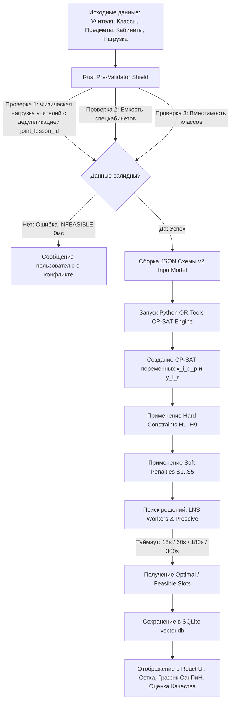

# Полная Спецификация Правил Составления Расписания (Master Timetable Specification)

Настоящий документ содержит **полный свод правил, норм, ограничений и математической логики**, применяемых в системе **VectorWorkspace** для формирования качественного, государственно-соответствующего (СанПиН РК) и физиологически комфортного школьного расписания.

---

## 1. Фундаментальные Цели «Нормального» Расписания

Расписание считается **оптимальным и нормальным**, если оно удовлетворяет трем категориям требований:
1. **Юридическо-санитарным (СанПиН № ҚР ДСМ-76):** Защищает здоровье учащихся, распределяя нагрузки по кривой умственной работоспособности и не допуская утомляемости.
2. **Организационным (Hard Constraints):** Полностью исключает накладки (пересечения) учителей, классов и кабинетов, синхронизирует класс-комплекты и деления на группы.
3. **Социально-комфортным (Soft Penalties):** Ликвидирует пустые «окна» в расписании педагогов, минимизирует смену кабинетов и выравнивает нагрузку по дням.

---

## 2. Необходимые Исходные Данные (Input Specifications)

Для успешного расчета расписания система требует 6 связанных справочников данных:

### 2.1 Учителя (`schedule_teachers`)
* **Идентификатор (`id`):** Уникальный строковый ключ.
* **ФИО (`full_name`):** Полное имя педагога.
* **Матрица доступности (`availability_json`):** 2D булева матрица $6 \times 8$ (`true` = доступен, `false` = выходной/запрещенный слот).
* **Максимум уроков в день (`max_daily_lessons`):** Лимит уроков в день (0 = без ограничений, 1..8 = жесткий лимит).
* **Базовый кабинет (`base_room_id`):** Закрепленный за учителем кабинет.

### 2.2 Классы (`schedule_classes`)
* **Идентификатор (`id`):** `1а`, `7б`, `7б_luo`, `4_do`.
* **Параллель (`grade`):** 1–11 класс.
* **Литера (`letter`):** `а`, `б`, `в`, `luo`, `do`.
* **Смена (`shift`):** `First` (1-я смена, с 1-го урока) или `Second` (2-я смена).
* **Тип класса (`class_type`):** `normal` (стандартный), `luo` (класс легкой умственной отсталости), `do` (домашнее обучение).

### 2.3 Предметы (`schedule_subjects`)
* **Балл сложности СанПиН (`sanitary_weight`):** От 1 до 11 баллов согласно Приложению 4 к № ҚР ДСМ-76.
* **Тип кабинета (`required_room_type`):** `General`, `Gym`, `PhysicsLab`, `ChemistryLab`, `Informatics`, `LanguageLab`, `Workshop`.
* **Деление на подгруппы (`requires_split`):** `true`/`false`.
* **Допуск спаренных уроков (`is_double_allowed`):** `true`/`false`.
* **Связанные предметы (`related_subjects_json`):** Список смежных дисциплин одного домена (например, `["algebra", "geometry"]`).

### 2.4 Кабинеты (`schedule_rooms`)
* **Идентификатор (`id`):** `room_1`, `room_gym_9`, `room_informatics_1`.
* **Тип кабинета (`room_type`):** Специализация помещения.
* **Вместимость (`capacity`):** Максимальное количество учащихся.

### 2.5 Нагрузка / Учебный План (`schedule_curriculum`)
* **Запись нагрузки:** `(class_id, subject_id, teacher_id, split_teacher2_id, hours_per_week, joint_lesson_id)`.
* **Идентификатор совмещения (`joint_lesson_id`):** Метка класс-комплекта для объединения парных классов (`7б` + `7б_luo`).

### 2.6 Временная Сетка (`time_grid`)
* **Дней в неделе:** 5 (пятидневка) или 6 (шестидневка).
* **Уроков в день:** 7 или 8 уроков.

---

## 3. Полный Реестр Ограничений (Constraints Hierarchy)

### 3.1 Жесткие Ограничения (Hard Constraints — 0 Допустимых Нарушений)

Если хотя бы одно жесткое ограничение нарушено, расписание считается **недействительным (`INFEASIBLE`)**:

1. **`H_teacher_no_overlap` (Бесконфликтность Учителя):**
   Учитель $T$ не может одновременно вести занятия в двух разных классах в один день $d$ и урок $p$, за исключением официально объявленных совмещенных уроков (`joint_lesson_id`).
   $$\sum_{i \in \text{Inst}(T, d, p)} x_{i, d, p} \le 1$$

2. **`H_class_no_overlap` (Бесконфликтность Класса):**
   Класс $C$ не может находиться на двух разных предметах одновременно на уроке $p$, если предмет не предполагает деления на подгруппы.
   $$\sum_{i \in \text{Inst}(C, d, p)} x_{i, d, p} \le 1$$

3. **`H_room_no_overlap` (Бесконфликтность Кабинета):**
   В кабинете $R$ не может проводиться более одного занятия в один и тот же слот $(d, p)$.
   $$\sum_{i \in \text{Inst}(R, d, p)} x_{i, d, p} \le 1$$

4. **`H_joint_lessons` (Синхронизация Класс-Комплектов):**
   Все уроки, входящие в одну группу совмещения `joint_lesson_id` (например, Урок Математики в `7б ЛУО` и Урок Алгебры/Геометрии в `7б`), обязаны проводиться **в один и тот же день $d$ и на одном и том же уроке $p$**.
   $$x_{\text{inst}_1, d, p} = x_{\text{inst}_2, d, p} \quad \forall d, p$$

5. **`H_subject_domains` (Размазывание по Неделе и Непрерывность Спарок):**
   * Если суммарная нагрузка предмета/домена $\le 5$ часов в неделю $\rightarrow$ **строго не более 1 урока в день** в данном классе (`sum(day_vars) <= 1`).
   * Если нагрузка $> 5$ часов в неделю (например, 6 часов) $\rightarrow$ допускается не более 2 уроков в день, причем эти 2 урока **обязаны идти строго подряд без разрывов** ($x_{p1} + x_{p2} \le 1$ для $p2 \ge p1 + 2$).

6. **`H_math_ordering` (Порядок Старта Математического Блока):**
   Для классов, имеющих Алгебру и Геометрию:
   * **Понедельник (d=0):** Первым уроком математического блока ставится **АЛГЕБРА** (Геометрия запрещена на Пн: $x_{\text{geom}, 0, p} = 0$).
   * **Вторник (d=1):** Заступает **ГЕОМЕТРИЯ** (Алгебра запрещена на Вт: $x_{\text{alg}, 1, p} = 0$).
   * **Среда, Четверг, Пятница:** Дисциплины продолжают гармонично чередоваться (Ср — Алг, Чт — Геом, Пт — Алг).

7. **`H_no_late_math` (Запрет Сложной Математики на Поздних Уроках):**
   * Предметы математического блока (`algebra`, `geometry`, `math`) **запрещены на 6-м и 7-м уроках ($p \ge 5$) в любой день недели**.
   * В **Понедельник ($d=0$) и Пятницу ($d=4$)** математический блок **запрещен на 5-м, 6-м и 7-м уроках ($p \ge 4$)**.

8. **`H_luo_priority` (Приоритет и Непрерывность Спецклассов ЛУО/ДО):**
   * **Нулевые окна (0 gaps):** Для всех спецклассов ЛУО и ДО уроки в течение любого дня образуют единый непрерывный блок без пустых промежутков.
   * **Запрет 7-го урока:** Классы ЛУО/ДО завершают обучение не позже 6-го урока ($x_{\text{luo}, d, 6} = 0$).

9. **`H_split_subgroups` (Параллельность Подгрупп):**
   При делении класса на подгруппы (Казахский/Иностранный язык, Информатика, Труд) обе подгруппы занимают один и тот же урок $p$ в разных кабинетах с разными учителями.

---

### 3.2 Мягкие Ограничения и Целевые Функция Штрафов (Soft Penalties — Минимизация)

Алгоритм CP-SAT минимизирует взвешенную сумму штрафов:
$$\text{Total Penalty} = w_1 S_{\text{window}} + w_2 S_{\text{sanpin}} + w_3 S_{\text{alt}} + w_4 S_{\text{room}} + w_5 S_{\text{balance}}$$

1. **`S_window` (Штраф за Окна Учителей):**
   Начисляется за каждый пустой урок между первым и последним уроком учителя в течение дня.

2. **`S_sanpin_parabola` & `S3b` (Отклонение от Кривой СанПиН и Попозиционный Штраф):**
   * **Дневной балл:** Сумма баллов трудности предметов класса за день должна стремиться к эталонной параболе (Пн: 7, Вт: 11, Ср: 9, Чт: 11, Пт: 7).
   * **Почасовая позиция:** 
     - Предметы **9–11 баллов** (`Алгебра`, `Геометрия`, `Физика`, `Химия`, `Языки`): идеальны на **2, 3 и 4 уроках** (штраф 0). На 1 уроке — штраф 2, на 5 уроке — штраф 8, на 6–7 уроках — тяжелый штраф 30+.
     - Предметы **1–4 баллов** (`Музыка`, `ИЗО`, `Труд`, `Физкультура`): идеальны на **5, 6 и 7 уроках** (штраф 0).

3. **`S_alternation` (Штраф за Нарушение Чередования):**
   Штрафует случаи, когда в один день у класса идут подряд только однотипные сложные предметы естественно-математического цикла без разгрузки гуманитарно-эстетическими дисциплинами.

4. **`S_room_displacement` (Перемещения Учителя):**
   Начисляет штраф за каждый случай, когда учитель вынужден менять кабинет между соседними уроками.

5. **`S_load_balance` (Баланс Дневной Нагрузки Класса):**
   Штрафует сильный разброс количества уроков по дням (например, 7 уроков во Вторник и 4 урока в Среду).

---

## 4. Государственные Нормативы Республики Казахстан (СанПиН № ҚР ДСМ-76)

### 4.1 Официальная Шкала Трудности Учебных Предметов (Приложение 4)

| Балл | Учебные предметы |
| :---: | :--- |
| **11** | Математика, Алгебра, Геометрия; Русский язык (в каз. школах); Казахский язык (в рус. школах) |
| **10** | Иностранный язык; Предметы на иностранном языке |
| **9** | Физика, Химия, Информатика, Биология |
| **8** | История Казахстана, Всемирная история, Основы права |
| **7** | Казахский язык и литература (в каз. школах); Русский язык и литература (в рус. школах) |
| **6** | Естествознание, География, Начальная начальная подготовка (НВП) |
| **5** | Физическая культура |
| **4** | Трудовое обучение, Технология |
| **3** | Черчение |
| **2** | Изобразительное искусство |
| **1** | Музыка |

### 4.2 Ограничения Максимальной Недельной Нагрузки (ГОСО РК)
* **1–4 классы:** Не более 27 часов в неделю (макс 5 уроков в день).
* **5–6 классы:** Не более 30.5 часов в неделю.
* **7 класс:** Не более 33.5 часов в неделю.
* **8 класс:** Не более 34.5 часов в неделю.
* **9–11 классы:** Не более 36 часов в неделю (макс 7 уроков в день для 9 кл, макс 8 для 10-11 кл).

---

## 5. Полный Цикл и Алгоритм Генерации (System Lifecycle)

---

## 6. Чек-Лист Проверки Идеального Расписания

Перед утверждением расписания администратором школы проверяются 6 ключевых показателей:
- [x] **0 пересечений** учителей, классов и кабинетов.
- [x] **100% синхронизация** сквозных класс-комплектов (`7б` и `7б ЛУО`).
- [x] **0 уроков математики** на 6-м и 7-м уроках и в конце Пн/Пт.
- [x] **2, 3, 4 уроки** полностью укомплектованы предметами 9–11 баллов сложности.
- [x] **0 окон** в расписании спецклассов ЛУО и ДО.
- [x] **0–1 окно** суммарно по всему педагогическому коллективу школы.
