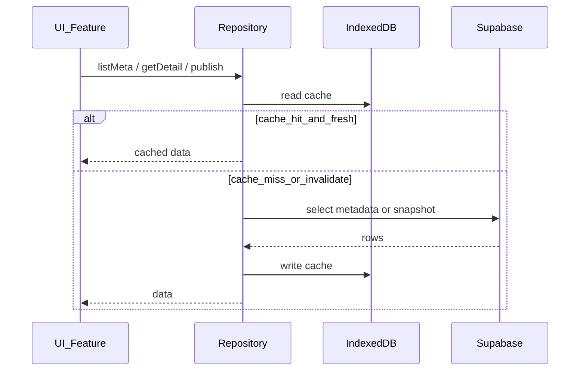

# Потоки данных и local-first

## Цели

- Минимизировать запросы к Postgres (лимиты free-tier + скорость UX).
- Черновики учителя остаются доступны offline (localStorage / IndexedDB).
- В облако уходит то, что нужно каталогу и другим устройствам: metadata + publish snapshot.

## Слои

## Правила запросов

1. **Список каталога** — только лёгкие поля (`TupMeta` / `KtpMeta`), без `plan_json`.
2. **Детали плана** — один fetch `plan_json` (или эквивалент), ключ кэша `entity:id:v{content_version}`.
3. **Редактор КТП** — правки в Redux + `localStorage`; сеть только при «Опубликовать» / явной синхронизации.
4. **Инвалидация** — при upload/publish admin/teacher вызывается `invalidateLocalCache()` для meta-списков.
5. **Нет Realtime** на старте — меньше трафика и сложности.

## Нормализация ТУП

При admin upload:

1. Файл парсится на клиенте (`parseAcademicPlan`).
2. Пишется `tup_documents` (metadata + `plan_json` snapshot).
3. Пишутся блоки: `tup_quarters` → `tup_sections` → `tup_topics` → `tup_objectives`.
4. Оригинал файла — в Storage bucket `tup-sources`.

`plan_json` — быстрый путь для создания КТП (1 запрос).  
Блоки — для фильтрации/аналитики/будущего конструктора и связи «предмет / класс / программа / тема».

## Создание КТП из каталога

1. Teacher выбирает ТУП в `/tup-catalog`.
2. `getDetail` (cache-first) → `upsertTup` в локальный Redux/`localStorage`.
3. Навигация в существующий редактор `/ktp-editor/:id` → `createKtpFromTup`.
4. Локальное сохранение как раньше; publish — отдельная кнопка.

## Публикация КТП

`KtpRepository.upsert({ status: 'published', plan_json, ... })`  
Каталог `/ktp-catalog` читает только `published` metadata, детали — по открытию + кэш.
