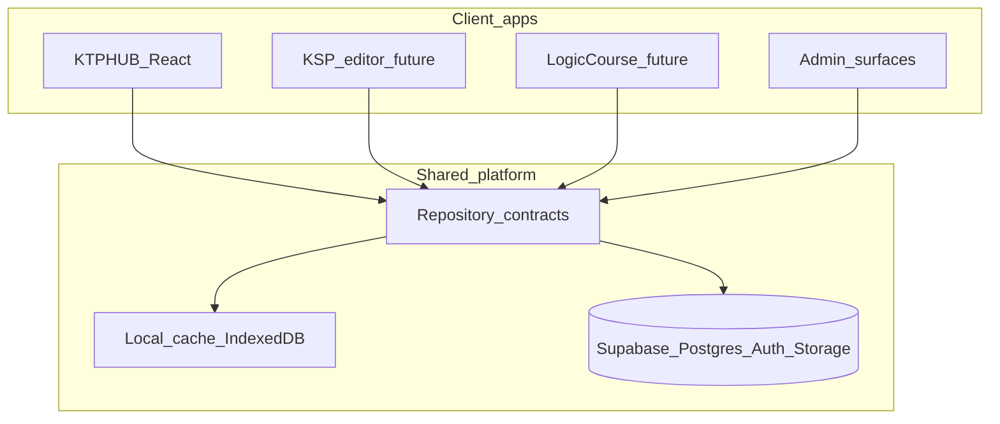

# Обзор платформы VectorWorkspace

## Зачем это

**VectorWorkspace** — монорепозиторий экосистемы для учителей и учеников:

| Продукт | Статус | Назначение |
|---------|--------|------------|
| **KTPHUB** | в разработке | Календарно-тематические планы (КТП), ТУП, журналы, СОР/СОЧ |
| **KSP editor** | планируется | Редактор краткосрочных планов (КСП) / поурочных планов |
| **Logic course** | планируется | Курс / тренажёр по логике (контент + прогресс ученика) |
| Общий auth / каталог | есть (Supabase) | Единый вход, роли, общие справочники и публикации |

Один аккаунт учителя должен в перспективе открывать несколько приложений без отдельной регистрации в каждом.

## Высокоуровневая схема

## Принципы платформы

1. **Один Supabase-проект** на старте — общая БД, auth, storage.
2. **Границы по доменам в схеме** (`profiles` общие; `tup_*` / `ktp_*` для KTPHUB; будущие `ksp_*`, `course_*`).
3. **Клиенты тонкие**: UI → use-cases/hooks → repositories → Supabase/local cache.
4. **Local-first**: тяжёлые планы кэшируются локально; в сеть уходят metadata и явные publish/sync.
5. **Смена бэкенда возможна**: repository interfaces не зависят от `supabase-js` в UI.

## Что уже сделано (фаза 1)

- Auth (регистрация / вход / роли `teacher` | `admin`)
- Каталог ТУП (admin upload + normalize blocks + publish)
- Создание КТП из каталожного ТУП
- Публикация КТП + каталог опубликованных КТП
- Repository layer + IndexedDB cache
- Shared env в корне монорепо
- SQL-миграции в `/supabase/migrations`
