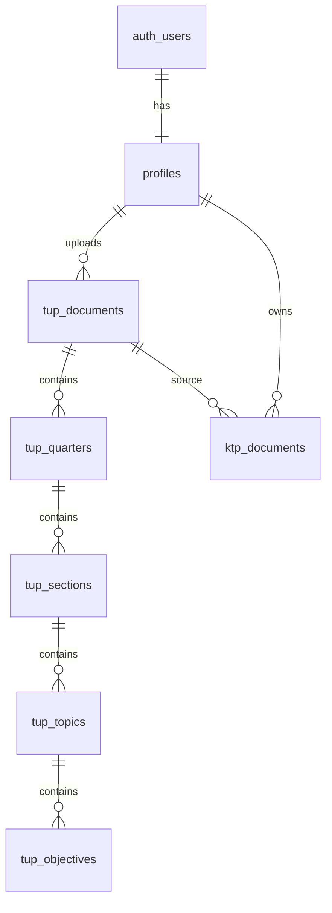

# Схема БД (платформа)

Актуальная миграция: [`supabase/migrations/001_init.sql`](../../supabase/migrations/001_init.sql).

## Общий домен (все приложения)

### `profiles`
| Колонка | Тип | Смысл |
|---------|-----|--------|
| `id` | uuid PK → `auth.users` | тот же id, что у Supabase Auth |
| `email` | text | |
| `display_name` | text | |
| `role` | `teacher` \| `admin` | платформенная роль |
| `created_at` / `updated_at` | timestamptz | |

Триггер `on_auth_user_created` создаёт профиль при регистрации.

Хелпер: `public.is_admin()` (security definer).

> Позже: `school_id`, `locale`, отдельные роли на продукт (`ksp_editor`, `course_author`) — через таблицы membership, не обязательно расширять enum сразу.

## Домен KTPHUB — ТУП

### `tup_documents` (карточка каталога + snapshot)
Metadata для фильтров: `title`, `subject`, `grade`, `language`, `program_kind` (`tup`|`tupr`), `academic_year`, `status` (`draft`|`published`|`archived`), `content_version`, `plan_json`, `source_file_path`, `uploaded_by`.

Индексы: `status`, `subject`, `grade`, `academic_year`.

### Нормализованные блоки
```text
tup_quarters
  └── tup_sections
        └── tup_topics
              └── tup_objectives
```

Связь с карточкой: `tup_quarters.tup_id → tup_documents.id` (cascade delete).

## Домен KTPHUB — КТП

### `ktp_documents`
`owner_id`, `title`, `source_tup_id`, `subject`, `grade`, `language`, `class_name`, `status` (`draft`|`published`), `content_version`, `plan_json`, `total_hours`, `quarter_work_hours`, `published_at`, timestamps.

## Storage

Bucket: `tup-sources` (private).  
Запись — admin; чтение — authenticated.

## Будущие домены (зарезервировать префиксы)

| Префикс | Продукт | Примеры таблиц |
|---------|---------|----------------|
| `ksp_` | Редактор КСП | `ksp_documents`, `ksp_lessons`, `ksp_templates` |
| `course_` | Курс логики | `course_modules`, `course_lessons`, `course_progress` |
| `school_` | Оргструктура | `school_orgs`, `school_members` |

Не создавать generic `documents` без префикса домена.

## ER (упрощённо)


