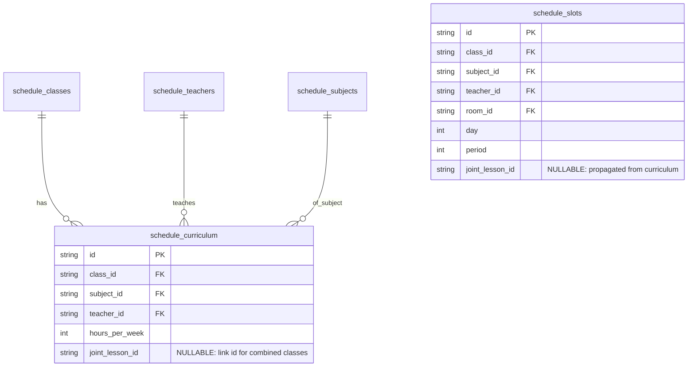

# Design Document: Joint Lessons (Совмещенные уроки / Класс-комплекты)

## Architecture Overview

Система расписания использует схему связывания строк нагрузки через легкий идентификатор `joint_lesson_id`.



---

## Technical Details

### 1. Database Schema
Добавляется новое поле `joint_lesson_id TEXT` в таблицы `schedule_curriculum` и `schedule_slots`:

```sql
ALTER TABLE schedule_curriculum ADD COLUMN joint_lesson_id TEXT;
ALTER TABLE schedule_slots ADD COLUMN joint_lesson_id TEXT;

CREATE INDEX IF NOT EXISTS idx_curriculum_joint ON schedule_curriculum(joint_lesson_id);
CREATE INDEX IF NOT EXISTS idx_slots_joint ON schedule_slots(joint_lesson_id);
```

### 2. CP-SAT Constraint Logic (`solver/engine.py`)

1. **Группировка сущностей:**
   При чтении массива `curriculum` записи группируются по `joint_lesson_id`. Если `joint_lesson_id is not None`, все уроки из этого множества для $k$-го часа недели связываются:
   ```python
   # Для всех уроков l1, l2 в одной группе совмещения:
   model.Add(day_vars[l1] == day_vars[l2])
   model.Add(period_vars[l1] == period_vars[l2])
   model.Add(room_vars[l1] == room_vars[l2])
   ```

2. **Сокращение нагрузки учителя (NoOverlap):**
   Для каждого учителя вместо добавления отдельного интервала на каждый урок из совмещенной группы добавляется **ровно один интервал** на весь совмещенный блок. Это предотвращает фальшивые коллизии `Teacher overlap` и снижает расчётные часы учителя с 40 до реальных 24 физических слотов.

### 3. Frontend & User Interface (`Desktop/src/domains/schedule/`)

1. **Управление связыванием:**
   В матрице нагрузки завуч может выбрать 2+ предмета одного учителя и нажать «Совместить уроки». Генерируется ID `jl_<uuid>` и проставляется выбранным записям.
2. **Отображение в сетке:**
   В `InteractiveGrid.tsx` ячейка с `joint_lesson_id` визуально выделяется бейджем со списком совмещенных классов (например, `6 / 6 ЛУО`).
